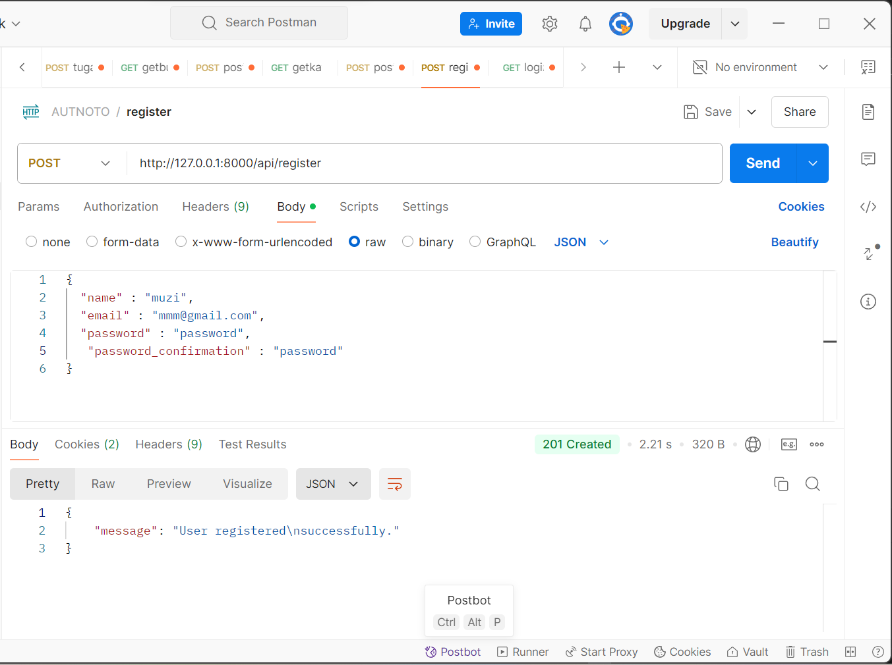
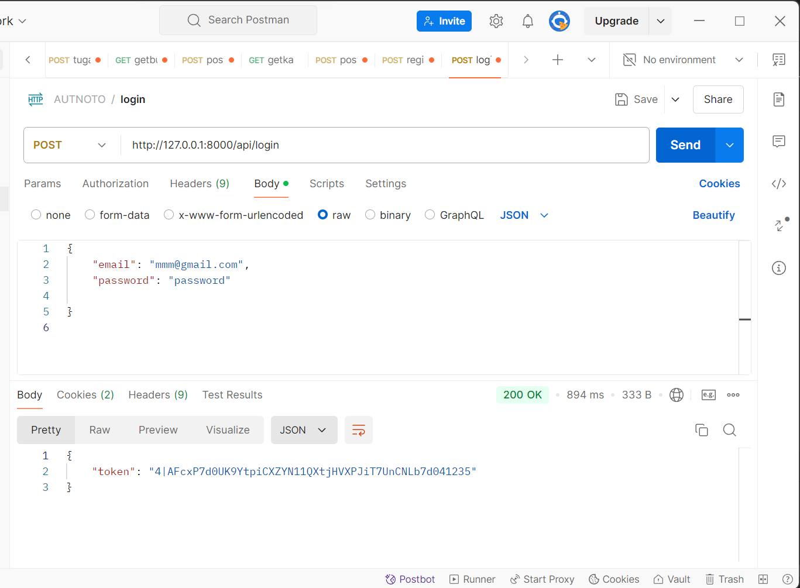
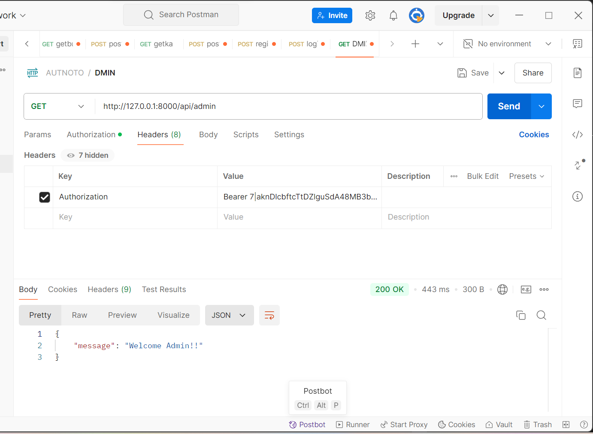
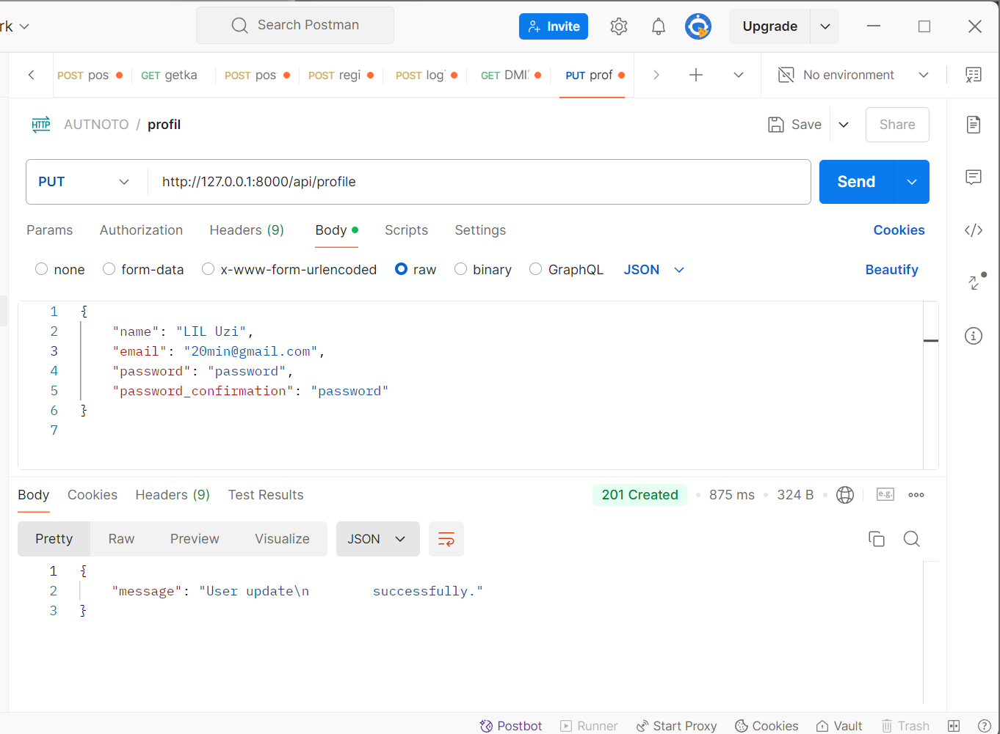
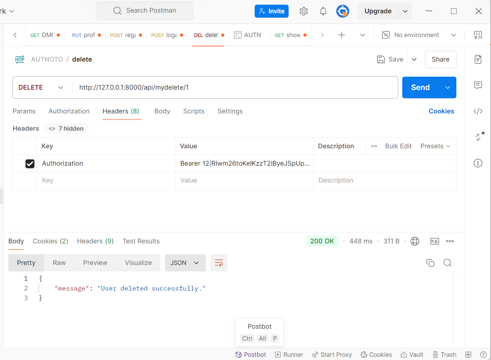
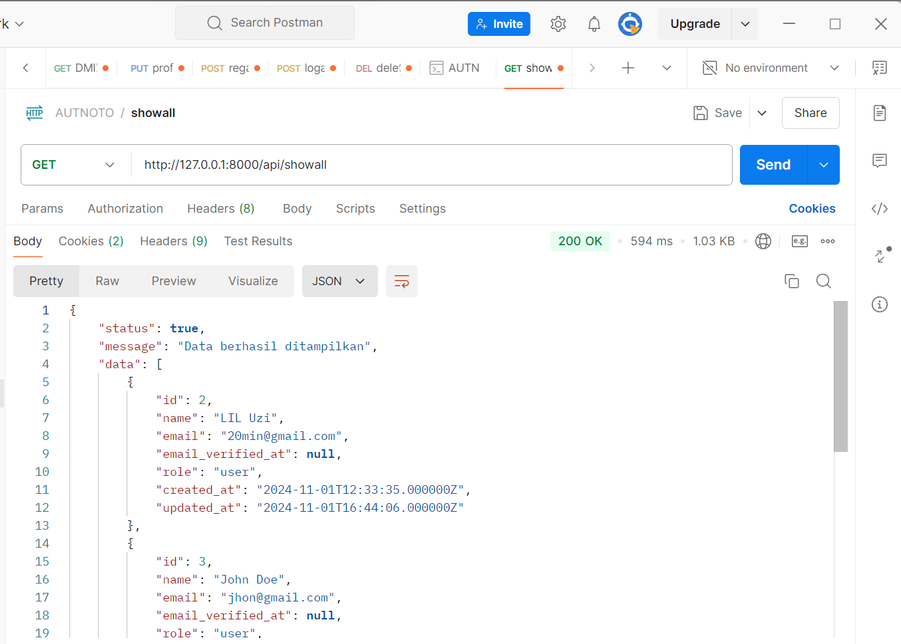

        1.
        2.
        3. hasilnya muncul dikarenakan  pada middleware saya izinkan untuk user

        TUGAS 
        1. Apa yang dimaksud dengan Laravel Sanctum?
        2. Bagaimana cara mengelola token autentikasi di Laravel?
        3. Sebutkan langkah-langkah untuk menambahkan otorisasi berbasis peran dalam API! 

            JAWAB
        1.laravel  sanctum adalah salah satu paket yang dikembangkan oleh laravel untuk menanggani otentikasi pengguna melalui api.paket ini dirancang untuk memberikan solusi otentikasi sederhana dan ringan, terutama untuk aplikasi single [age application(SPA),aplikasi mobile,dan api sederhana].https://blog.akhdani.co.id/2024/06/25/mengenal-laravel-sanctum-sebagai-solusi-otentikasi-api-yang-sederhana-dan-efektif/

        2.pertama dimulai dengan  kita menginstal sanctum terlebih dahulu  lalu dimigrate, stetelah itu kita atur user modelnya di folder models untuk menentukan table yng bisa diisi dan  tabel yang tdisembunyikan,lalu membuat controllernya untuk  autintasi register dan login dimulai dengan mengvalidasi register lalu  insert data registernya y=untuk loginya sama saja sepeerti register. setelah memodifikasi controller dilanjutykan dengan membuat routingnya di api.php dimana isinya adalah perintah post pada authcontroller denggan nama method yang kita buat sebelumnya.

        3.untuk  otorisasi dilakukan dengan kita membuat file dimiddleware dengan nama ChechRole  yang digunakan untuk melakukan pengecekan pada rolenya lalau daftarkan middleware yang kita buat sebelumnya dikernel,lalu buat route di api edngan middleware untuk role yang dibutuhkan

        TUGAS PRATIKUM
        1.
        2. https://stackoverflow.com/questions/22426165/laravel-soft-delete-posts
        3. https://abdulrahmann.com/2024/01/30/menampilkan-data-dari-database-dengan-controller-pada-laravel-10-6/